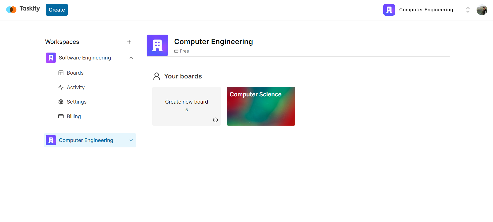
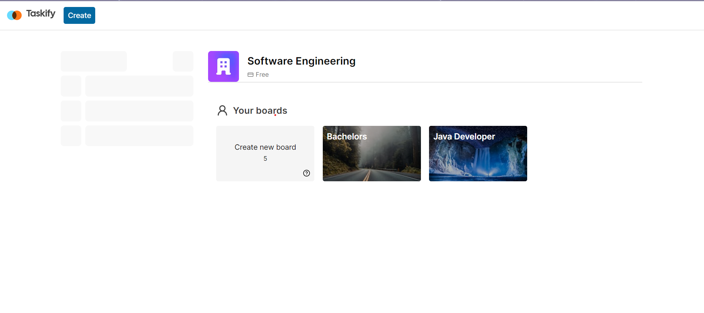
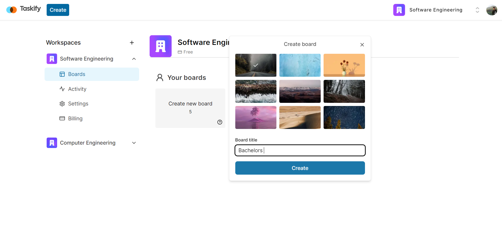
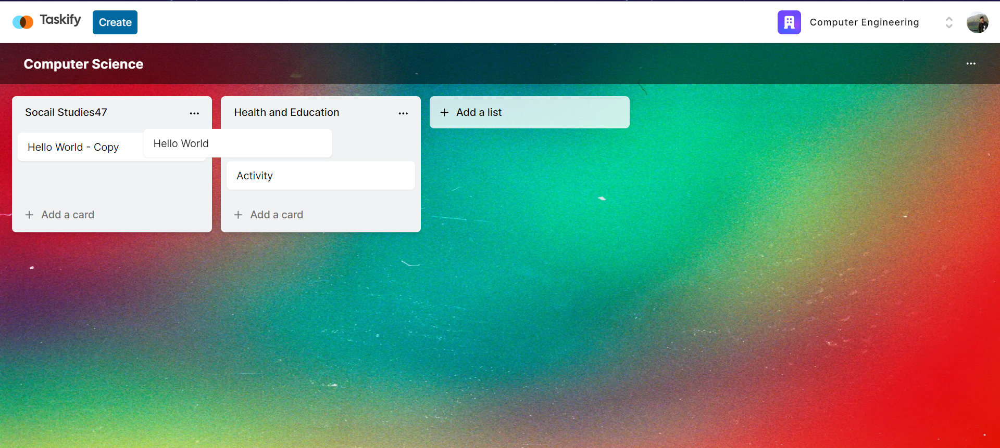
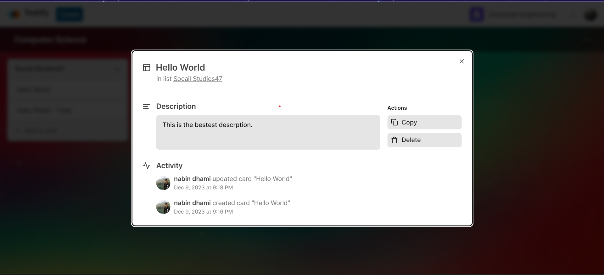
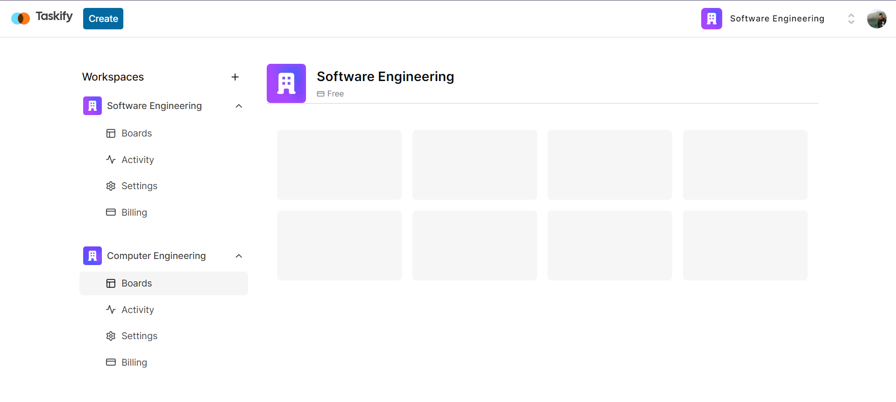

# [Fullstack Trello Clone](https://www.youtube.com/watch?v=pRybm9lXW2c&ab_channel=CodeWithAntonio)

This Fullstack Trello Clone leverages a powerful tech stack, incorporating **Next.js 14**, **Server Actions**, **React**, **Prisma**, **Stripe**, **Tailwind**, and **MySQL**. The application boasts a range of key features, including robust **authentication** for secure access, flexible **organization and workspace management**, dynamic **board creation** enriched with captivating Unsplash API-integrated cover images, and a detailed **activity log** providing insights into organizational activities. Users can seamlessly perform operations such as board, list, and card creation, renaming, deletion, and reordering. The system also implements **board limits** for effective resource management. The UI, designed with `shadcnUI` and `TailwindCSS`, promises a visually pleasing and responsive experience. The integration of **Stripe** opens avenues for potential premium features or subscription models, further enhancing the versatility of this Fullstack Trello Clone.

